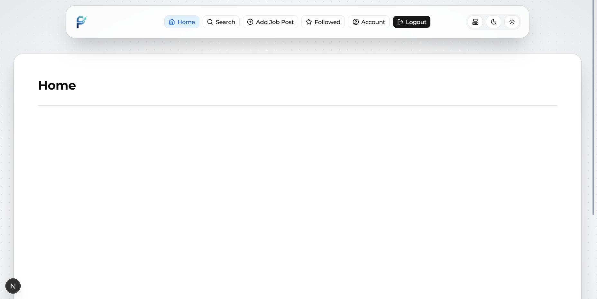
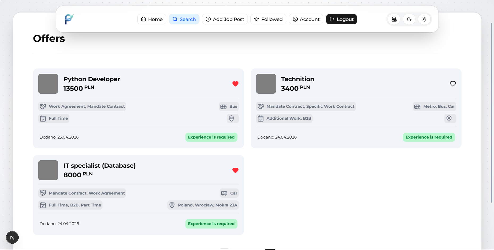
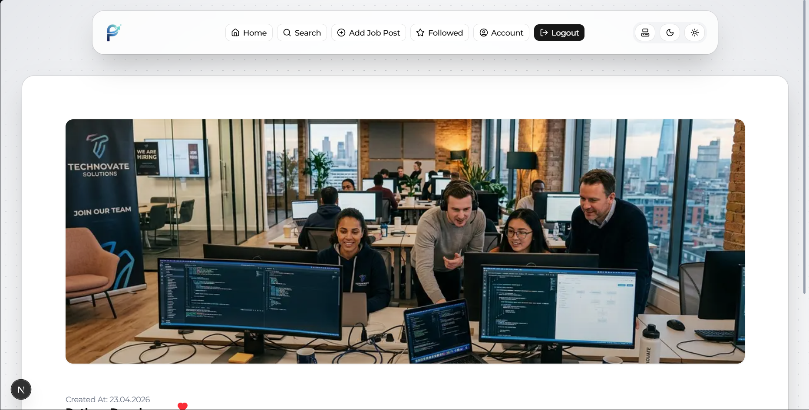
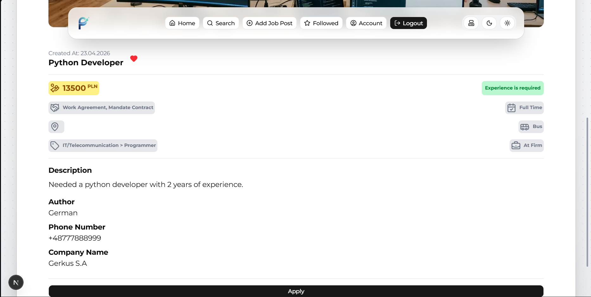
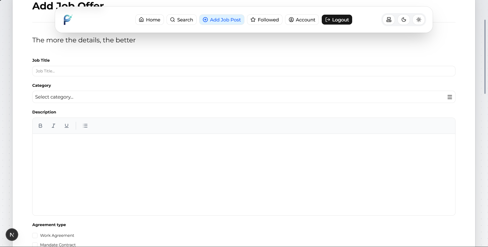
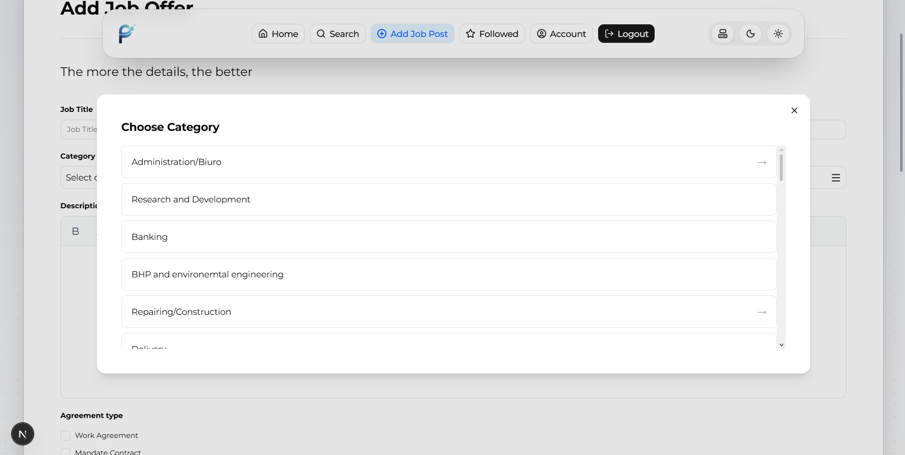
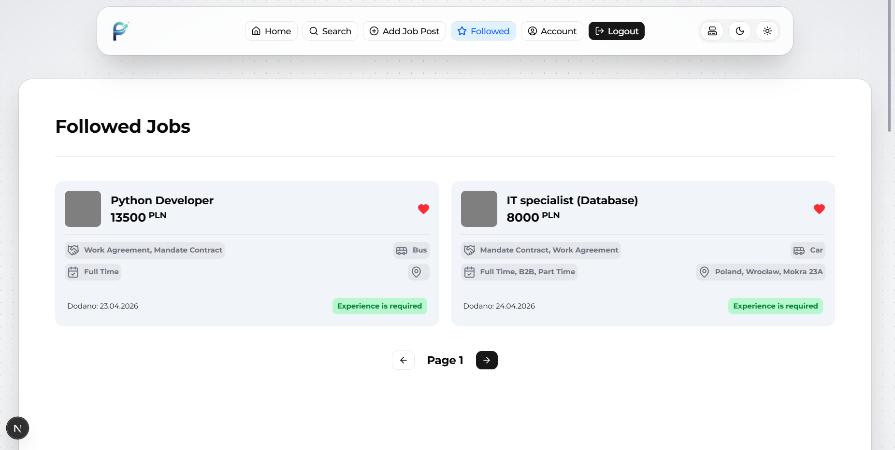
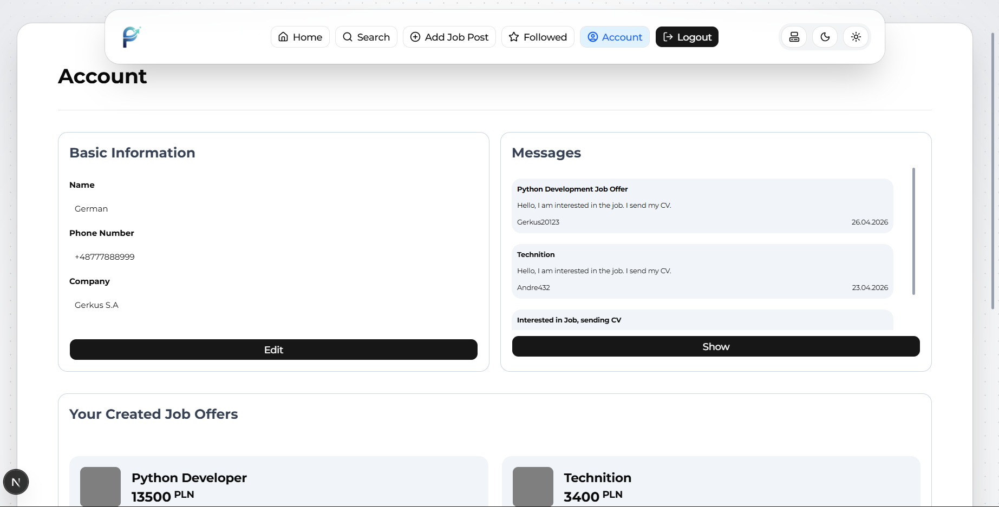

 
     
     

 

 
     
     

 

 
     
     

 

  
     

# 🚀 Pivotsy #

Pivotsy to aplikacja webowa będąca platformą do wyszukiwania ofert pracy oraz ich przeglądania i zarządzania nimi. Projekt łączy nowoczesny frontend z wydajnym backendem, oferując funkcjonalności zarówno dla kandydatów, jak i twórców ofert.

# 🧱 Stack technologiczny # 
## Frontend ##
* Next.js (plus Axios jako interface API pomiędzy Flask a frontend)
* Responsywny UI (do dalszego rozwoju)
## Backend ## 
* Flask (Flask-Smorest) – REST API
* SQLAlchemy – ORM
* SQLite – baza danych
## Autoryzacja ##
* JWT (access + refresh tokens)

# ✨ Aktualnie zaimplementowane funkcjonalności # 
## 🔐 Autoryzacja użytkownika ##
* Rejestracja
* Logowanie
* Wylogowanie
* JWT (access + refresh tokeny)

# 🧭 Nawigacja #
* Navigation bar dostępny w aplikacji

# 💼 Oferty pracy #
* Przeglądanie ofert pracy
* Dodawanie nowych ofert pracy
* Polubienie / odlubienie ofert
* Lista followed jobs (polubione oferty)

# 👤 Profil użytkownika #
* Podstawowe informacje o użytkowniku
* Lista ofert pracy utworzonych przez użytkownika

# 🛠️ Planowane funkcjonalności #

## 🔎 Wyszukiwanie i filtrowanie ##
* Filtrowanie ofert (np. kategoria, lokalizacja, typ pracy)
* Ulepszona wyszukiwarka

## 🎨 UI/UX ## 
* Poprawa interfejsu użytkownika
* Lepszy layout formularzy

## 💬 Komunikacja ## 
* Strona Account
* Chat między użytkownikiem a kandydatami aplikującymi na ofertę

## 🔐 Architektura aplikacji ##
* Podział na:
- (public) – dostępne bez logowania
- (private) – wymagające autoryzacji

# Obecna struktura projektu #
pivotsy/
│
├── frontend/        # Next.js app
│
├── backend/         # Flask API
│   ├── models/
│   ├── routes/
│   ├── schemas/
│   └── services/
│
├── database/        # SQLite DB
│
└── README.md

# ⚙️ Uruchomienie projektu #
cd backend
pip install -r requirements.txt
flask run

cd frontend
npm install
npm run dev

# 📌 Status projektu #
Projekt jest w trakcie rozwoju. Główne funkcjonalności działają, ale planowane są kolejne rozszerzenia i poprawki UX/UI.

# 💡 Wizja #

Celem Pivotsy jest stworzenie przejrzystej, intuicyjnej platformy, która:
* ułatwia znajdowanie pracy,
* wspiera komunikację między kandydatami a pracodawcami,
* oferuje nowoczesne podejście do zarządzania ofertami pracy.